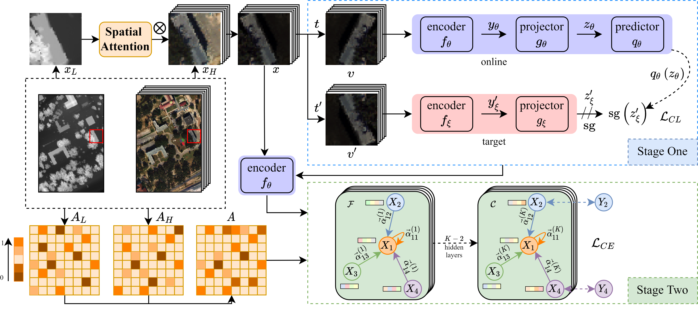

# MAGE: Multisource Attention Networks with Discriminative Graph and Informative Entities for Classification of Hyperspectral and LiDAR Data

## Description
This is the official PyTorch implementation of the MAGE paper (**TGRS under review**).
<div align=center></div>

This repository will be fully completed after the article is accepted.

## Prerequisites
- Dependency
  - See `requirements.txt`
- Dataset
  - [baiduwangpan](https://pan.baidu.com/s/1aeVm8dCaw9xEBFV6vRE5qQ), extraction code: **d7x3**
  - [Google Drive](https://drive.google.com/file/d/18MBuCG-sHYdNEpbB0J7DxKx1LauYUX-F/view?usp=sharing)
- Checkpoints
  - [baiduwangpan](https://pan.baidu.com/s/1yuZ4PhqgjBB172y_LYpSUg), extraction code: **safz**
  - [Google Drive](https://drive.google.com/drive/folders/1uskMQo5APOito0RNS-rfpaXBvA9ytaXg?usp=sharing)

## Usage
After configuring the environment and replacing the dataset and checkpoint folders with contents from the above links, one can use the following commands to **use checkpoints for evaluation** or **train from scratch**.
- Evaluation with checkpoints
```python
python test.py
```
- Train from scratch
```python
python main.py
```

## Results
| Dataset | OA (%) | AA (%) | Kappa |
| :----: | :----: | :----: | :----: |
| MUUFL  | 95.26 | 96.27 | 93.79 |
| Trento  | 98.93 | 98.45 | 98.57 |
| Houston  | 94.59 | 95.27 | 94.15 |

## Data
**Note: Relevant work should be cited when using the dataset to avoid copyright disputes.**
- [MUUFL](https://github.com/GatorSense/MUUFLGulfport/tree/master/MUUFLGulfportSceneLabels)
- [Trento](https://github.com/danfenghong/IEEE_GRSL_EndNet/blob/master/README.md)
- [Houston](https://hyperspectral.ee.uh.edu/?page_id=459)

## Baseline
- [FusAtNet: Dual Attention Based SpectroSpatial Multimodal Fusion Network for Hyperspectral and LiDAR classification](https://openaccess.thecvf.com/content_CVPRW_2020/html/w6/Mohla_FusAtNet_Dual_Attention_Based_SpectroSpatial_Multimodal_Fusion_Network_for_Hyperspectral_CVPRW_2020_paper.html)
- [S²ENet: Spatial–Spectral Cross-Modal Enhancement Network for Classification of Hyperspectral and LiDAR Data](https://ieeexplore.ieee.org/abstract/document/9583936)
- [Deep Encoder–Decoder Networks for Classification of Hyperspectral and LiDAR Data](https://ieeexplore.ieee.org/abstract/document/9179756)
- [More diverse means better: Multimodal deep learning meets remote-sensing imagery classification](https://ieeexplore.ieee.org/document/9174822/)
- [Learning from labeled and unlabeled data with label propagation](https://citeseerx.ist.psu.edu/viewdoc/download?doi=10.1.1.14.3864&rep=rep1&type=pdf)

## Citation
If you find this code to be useful for your research, please consider citing.
```
```

## Acknowledgements
 - [NVIDIA/DALI - A GPU-accelerated library containing highly optimized building blocks and an execution engine for data processing to accelerate deep learning training and inference applications.](https://github.com/NVIDIA/DALI)
 - [pyg-team/pytorch_geometric - Graph Neural Network Library for PyTorch](https://github.com/pyg-team/pytorch_geometric)
 - [wandb - A tool for visualizing and tracking your machine learning experiments.](https://github.com/wandb/wandb)
